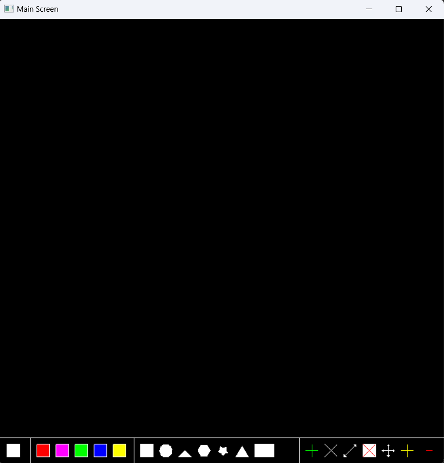
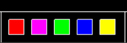
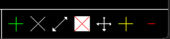

# PaintOpenGL Project

## Authors
- Jadir Pires de Borba Junior
- José Augusto Cenci Castilho


## Features
- Draw different forms: 
  - square; 
  - Rectangle; 
  - Circle;
  - Triangle isoceles; 
  - Hexagon;
  - Star;
- Set forms and border colors;
- Change the color of the forms and borders;
- Change the size of the forms;
- Change the position of the forms;
- Change the number of star points;
- Erasing forms;
- Erasing all forms;

## Main Screen



## Color section
```
At this section, is possible to see the colors 
that you can define to the forms and borders. 
You can change the color of the forms clicking
with the left mouse button and the color of the 
border clicking with the right mouse button.
```




## Form section
```
At this section, you can define the form you want 
to draw clicking with the mouse left button. The 
available forms are, in this order:
  - Square;
  - Circle;
  - Triangle isoceles;
  - Hexagon;
  - Star;
  - Triangle Equilateral;
  - Rectangle;
```


## Modes Section
```
At this section, you can define the mode you want 
to use clicking with the mouse left button. The 
available modes are, in this order:
  - Insert mode;
  - Erase mode;
  - Resize mode;
  - Erase all mode;
  - Edit mode;
  - Add point mode;
  - Remove point mode;
```


### Available Modes and Actions

#### 1. **Insert Mode**
- Insert a form by left-clicking anywhere on the screen.

#### 2. **Erase Mode**
- Erase a form by left-clicking on it.

#### 3. **Resize Mode**
- Resize a form by left-clicking and dragging on the form.

#### 4. **Erase All Mode**
- Erase all forms by left-clicking on the erase tool.

#### 5. **Edit Mode**
Edit an existing form by left-clicking on it. The following actions are available in this mode:

- **Move the form**:  
  Drag and drop the form by holding down the left mouse button.

- **Change the form color**:  
  Left-click on a tool inside the `Color Section` to select a new color.

- **Change the border color**:  
  Right-click on a tool inside the `Color Section` to choose a border color.

- **Change the form type**:  
  Left-click on a tool inside the `Form Section` to change the form type.

#### 6. **Add Point Mode**
- Add a point to a star form by left-clicking on the tool.

#### 7. **Remove Point Mode**
- Remove a point from the star form by left-clicking on the tool.
